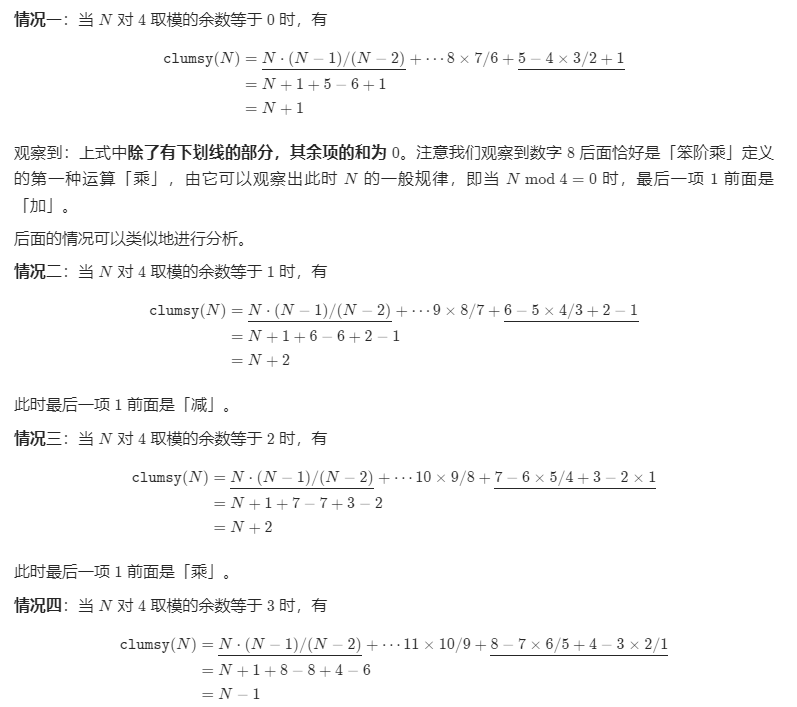

# 1006. 笨阶乘
通常，正整数 `n` 的阶乘是所有小于或等于 `n` 的正整数的乘积。例如，`factorial(10) = 10 * 9 * 8 * 7 * 6 * 5 * 4 * 3 * 2 * 1`。

相反，我们设计了一个笨阶乘 `clumsy`：在整数的递减序列中，我们以一个固定顺序的操作符序列来依次替换原有的乘法操作符：乘法(*)，除法(/)，加法(+)和减法(-)。

例如，`clumsy(10) = 10 * 9 / 8 + 7 - 6 * 5 / 4 + 3 - 2 * 1`。然而，这些运算仍然使用通常的算术运算顺序：我们在任何加、减步骤之前执行所有的乘法和除法步骤，并且按从左到右处理乘法和除法步骤。

另外，我们使用的除法是地板除法（<em>floor division</em>），所以 `10 * 9 / 8` 等于 `11`。这保证结果是一个整数。

实现上面定义的笨函数：给定一个整数 `N`，它返回 `N` 的笨阶乘。

 

**示例 1：**

**输入：**4
**输出：**7
**解释：**7 = 4 * 3 / 2 + 1


**示例 2：**

**输入：**10
**输出：**12
**解释：**12 = 10 * 9 / 8 + 7 - 6 * 5 / 4 + 3 - 2 * 1


**提示：**

<ol>

- `1 <= N <= 10000`

- `-2^31 <= answer <= 2^31 - 1`  （答案保证符合 32 位整数。）
</ol>

## 我的代码
```c++
class Solution {
public:
    int clumsy(int N) {
        int rst = 0;
        int tmp = N--;
        while (N > 0) {
            tmp *= N--;
            if (N <= 0)return rst + tmp;
            tmp /= N--;
            if (N <= 0)return rst + tmp;
            tmp += N--;
            if (N <= 0)return rst + tmp;
            rst += tmp;
            tmp = -N--;
        }
        return rst+tmp;
    }
};
```
> 执行用时：0 ms, 在所有 C++ 提交中击败了100.00%的用户
>
> 内存消耗：5.9 MB, 在所有 C++ 提交中击败了55.76%的用户

## 题解



```c++
class Solution {
public:
    int clumsy(int N) {
        if (N == 1) {
            return 1;
        } else if (N == 2) {
            return 2;
        } else if (N == 3) {
            return 6;
        } else if (N == 4) {
            return 7;
        }

        if (N % 4 == 0) {
            return N + 1;
        } else if (N % 4 <= 2) {
            return N + 2;
        } else {
            return N - 1;
        }
    }
};

作者：LeetCode-Solution
链接：https://leetcode-cn.com/problems/clumsy-factorial/solution/ben-jie-cheng-by-leetcode-solution-deh2/
来源：力扣（LeetCode）
著作权归作者所有。商业转载请联系作者获得授权，非商业转载请注明出处。
```

