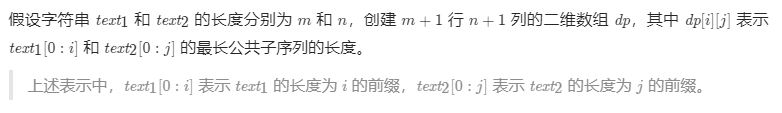
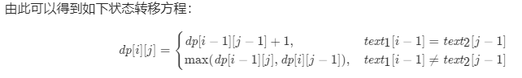
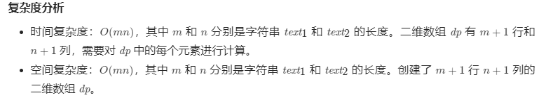

# 1143. 最长公共子序列
给定两个字符串 `text1` 和 `text2`，返回这两个字符串的最长 **公共子序列** 的长度。如果不存在 **公共子序列** ，返回 `0` 。

一个字符串的 **子序列**<em> </em>是指这样一个新的字符串：它是由原字符串在不改变字符的相对顺序的情况下删除某些字符（也可以不删除任何字符）后组成的新字符串。


- 例如，`"ace"` 是 `"abcde"` 的子序列，但 `"aec"` 不是 `"abcde"` 的子序列。


两个字符串的 **公共子序列** 是这两个字符串所共同拥有的子序列。

 

**示例 1：**

**输入：**text1 = "abcde", text2 = "ace" 
**输出：**3  
**解释：**最长公共子序列是 "ace" ，它的长度为 3 。


**示例 2：**

**输入：**text1 = "abc", text2 = "abc"
**输出：**3
**解释：**最长公共子序列是 "abc" ，它的长度为 3 。


**示例 3：**

**输入：**text1 = "abc", text2 = "def"
**输出：**0
**解释：**两个字符串没有公共子序列，返回 0 。


**提示：**


- `1 <= text1.length, text2.length <= 1000`

- `text1` 和 `text2` 仅由小写英文字符组成。


## 我的代码
```c++
class Solution {
public:
    int longestCommonSubsequence(std::string text1, std::string text2) {
        int l1 = text1.size();
        std::vector<int> rcd;//存长度为i的公共子串在text1中最前结尾位置
        for (char c:text2) {
            //从后往前更新rcd
            int len = rcd.size();
            for (int i = rcd.empty() ? 0 : rcd.back() + 1; i < l1; ++i) {
                if (text1[i] == c) {
                    rcd.push_back(i);
                    break;
                }
            }
            for (int i = len - 1; i >= 0; --i) {
                for (int j = i > 0 ? rcd[i - 1] + 1 : 0; j < rcd[i]; ++j) {
                    if (text1[j] == c) {
                        rcd[i] = j;
                        break;
                    }
                }
            }
        }
        return rcd.size();
    }
};
```
> 执行用时：4 ms, 在所有 C++ 提交中击败了99.97%的用户
>
> 内存消耗：6.2 MB, 在所有 C++ 提交中击败了97.75%的用户

## 题解





```c++
class Solution {
public:
    int longestCommonSubsequence(string text1, string text2) {
        int m = text1.length(), n = text2.length();
        vector<vector<int>> dp(m + 1, vector<int>(n + 1));
        for (int i = 1; i <= m; i++) {
            char c1 = text1.at(i - 1);
            for (int j = 1; j <= n; j++) {
                char c2 = text2.at(j - 1);
                if (c1 == c2) {
                    dp[i][j] = dp[i - 1][j - 1] + 1;
                } else {
                    dp[i][j] = max(dp[i - 1][j], dp[i][j - 1]);
                }
            }
        }
        return dp[m][n];
    }
};

作者：LeetCode-Solution
链接：https://leetcode-cn.com/problems/longest-common-subsequence/solution/zui-chang-gong-gong-zi-xu-lie-by-leetcod-y7u0/
来源：力扣（LeetCode）
著作权归作者所有。商业转载请联系作者获得授权，非商业转载请注明出处。
```



我这空间复杂度比题解强呀，有空写个题解