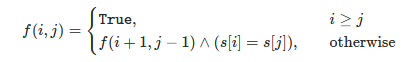

# [131. 分割回文串](https://leetcode-cn.com/problems/palindrome-partitioning/)

给定一个字符串 *s*，将 *s* 分割成一些子串，使每个子串都是回文串。

返回 *s* 所有可能的分割方案。

**示例:**

```
输入: "aab"
输出:
[
  ["aa","b"],
  ["a","a","b"]
]
```

```c++
class Solution {
public:
    //动态规划，rst中存储当前位之前的分割所有可能
    //更新只有两种可能，一种为末尾为全相同子串且字符与新加字符相同，那么就直接加就行
    //另一种为末尾字符串前一个字符串为单个字符，与新加字符相同，三者组合成为回文字符串
    std::vector<std::vector<std::string>> partition(std::string s) {
        if (s.empty())return {};
        std::vector<std::vector<std::string>> rst = {{{s[0]}}};
        std::vector<bool> is_back_all_same = {true};
        int n = s.size();
        for (int i = 1; i < n; ++i) {
            int len = rst.size();
            for (int j = 0; j < len; ++j) {
                if (is_back_all_same[j] && rst[j].back()[0] == s[i]) {
                    rst.push_back(rst[j]);
                    rst[j + len].back().push_back(s[i]);
                    is_back_all_same.push_back(true);
                } else {
                    int jlen = rst[j].size();
                    if (jlen > 1 && rst[j][jlen - 2].size() == 1 && rst[j][jlen - 2][0] == s[i]){
                        std::string tmp = rst[j][jlen - 2]+rst[j].back()+rst[j][jlen - 2];
                        rst.push_back(rst[j]);
                        rst.back().erase(rst.back().end()-2,rst.back().end());
                        rst.back().push_back(tmp);
                        is_back_all_same.push_back(false);
                    }
                }
            }
            for (int j = 0; j < len; ++j) {
                rst[j].push_back({s[i]});
                is_back_all_same[j] = true;
            }
        }
        return rst;
    }
};
```

> 执行用时：128 ms, 在所有 C++ 提交中击败了86.17% 的用户
>
> 内存消耗：64.7 MB, 在所有 C++ 提交中击败了75.72% 的用户

题解不是我的菜。。。估计思路也就差不多

题解的重点是有一步预处理：

判断s的子串s[i...j]是否为回文串：

利用动态规划的方法，状态转移方程为：



总体代码如下：

```c++
class Solution {
private:
    vector<vector<int>> f;
    vector<vector<string>> ret;
    vector<string> ans;
    int n;

public:
    void dfs(const string& s, int i) {
        if (i == n) {
            ret.push_back(ans);
            return;
        }
        for (int j = i; j < n; ++j) {
            if (f[i][j]) {
                ans.push_back(s.substr(i, j - i + 1));
                dfs(s, j + 1);
                ans.pop_back();
            }
        }
    }

    vector<vector<string>> partition(string s) {
        n = s.size();
        f.assign(n, vector<int>(n, true));

        for (int i = n - 1; i >= 0; --i) {
            for (int j = i + 1; j < n; ++j) {
                f[i][j] = (s[i] == s[j]) && f[i + 1][j - 1];
            }
        }

        dfs(s, 0);
        return ret;
    }
};
```


