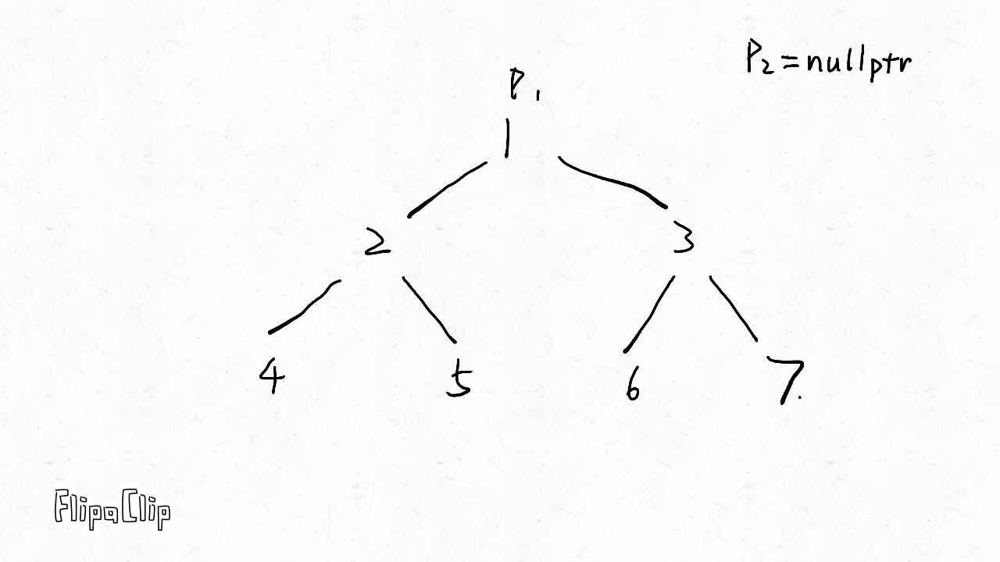

# [144. 二叉树的前序遍历](https://leetcode-cn.com/problems/binary-tree-preorder-traversal/)

给定一个二叉树，返回它的 *前序* 遍历。

 **示例:**

```
输入: [1,null,2,3]  
   1
    \
     2
    /
   3 

输出: [1,2,3]
```

**进阶:** 递归算法很简单，你可以通过迭代算法完成吗？

```c++
class Solution {
public:
    std::vector<int> preorderTraversal(TreeNode* root) {
        if (root == nullptr)return {};
        std::stack<TreeNode*> stk;
        std::vector<int> rst;
        stk.push(root);
        while (!stk.empty()){
            TreeNode* cur = stk.top();
            stk.pop();
            rst.push_back(cur->val);
            if (cur->right)stk.push(cur->right);
            if (cur->left)stk.push(cur->left);
        }
        return rst;
    }
};
```

> 执行用时：4 ms, 在所有 C++ 提交中击败了48.52% 的用户
>
> 内存消耗：8.6 MB, 在所有 C++ 提交中击败了19.99% 的用户

**Morris 遍历**

```c++
class Solution {
public:
    vector<int> preorderTraversal(TreeNode *root) {
        vector<int> res;
        if (root == nullptr) {
            return res;
        }
        TreeNode *p1 = root, *p2 = nullptr;
        while (p1 != nullptr) {
            p2 = p1->left;
            if (p2 != nullptr) {
                while (p2->right != nullptr && p2->right != p1) {
                    p2 = p2->right;
                }
                if (p2->right == nullptr) {
                    res.emplace_back(p1->val);
                    p2->right = p1;
                    p1 = p1->left;
                    continue;
                } else {
                    p2->right = nullptr;
                }
            } else {
                res.emplace_back(p1->val);
            }
            p1 = p1->right;
        }
        return res;
    }
};
```



时间复杂度：O(n)，其中 n 是二叉树的节点数。没有左子树的节点只被访问一次，有左子树的节点被访问两次。

空间复杂度：O(1)。只操作已经存在的指针（树的空闲指针），因此只需要常数的额外空间。
