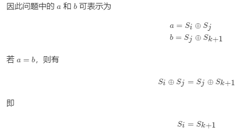
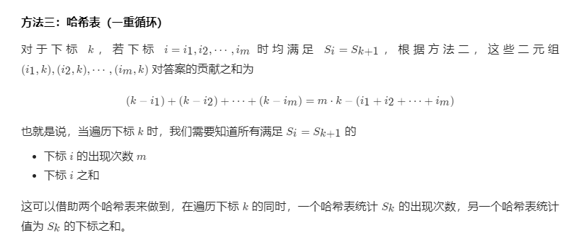

# 1442. 形成两个异或相等数组的三元组数目
给你一个整数数组 `arr` 。

现需要从数组中取三个下标 `i`、`j` 和 `k` ，其中 `(0 <= i < j <= k < arr.length)` 。

`a` 和 `b` 定义如下：


- `a = arr[i] ^ arr[i + 1] ^ ... ^ arr[j - 1]`

- `b = arr[j] ^ arr[j + 1] ^ ... ^ arr[k]`


注意：**^** 表示 **按位异或** 操作。

请返回能够令 `a == b` 成立的三元组 (`i`, `j` , `k`) 的数目。

 

**示例 1：**

**输入：**arr = [2,3,1,6,7]
**输出：**4
**解释：**满足题意的三元组分别是 (0,1,2), (0,2,2), (2,3,4) 以及 (2,4,4)


**示例 2：**

**输入：**arr = [1,1,1,1,1]
**输出：**10


**示例 3：**

**输入：**arr = [2,3]
**输出：**0


**示例 4：**

**输入：**arr = [1,3,5,7,9]
**输出：**3


**示例 5：**

**输入：**arr = [7,11,12,9,5,2,7,17,22]
**输出：**8


**提示：**


- `1 <= arr.length <= 300`

- `1 <= arr[i] <= 10^8`


## 我的代码

```c++

class Solution {
  public:
    int countTriplets(vector<int> &arr) {
        int n = arr.size();
        int rst = 0;
        for (int k = 1; k < n; k++) {
            arr[k] ^= arr[k - 1];
            for (int j = 1; j <= k; ++j) {
                for (int i = 0; i < j; ++i) {
                    if (i == 0) {
                        if (arr[j - 1] == (arr[j - 1] ^ arr[k]))
                            rst++;
                    } else {
                        if ((arr[j - 1] ^ arr[i - 1]) == (arr[j - 1] ^ arr[k]))
                            rst++;
                    }
                }
            }
        }
        return rst;
    }
};
```
> 执行用时：320 ms, 在所有 C++ 提交中击败了10.23%的用户
>
> 内存消耗：7.1 MB, 在所有 C++ 提交中击败了81.86%的用户

## 题解



```c++
class Solution {
public:
    int countTriplets(vector<int> &arr) {
        int n = arr.size();
        vector<int> s(n + 1);
        for (int i = 0; i < n; ++i) {
            s[i + 1] = s[i] ^ arr[i];
        }
        int ans = 0;
        for (int i = 0; i < n; ++i) {
            for (int k = i + 1; k < n; ++k) {
                if (s[i] == s[k + 1]) {
                    ans += k - i;
                }
            }
        }
        return ans;
    }
};

作者：LeetCode-Solution
链接：https://leetcode-cn.com/problems/count-triplets-that-can-form-two-arrays-of-equal-xor/solution/xing-cheng-liang-ge-yi-huo-xiang-deng-sh-jud0/
来源：力扣（LeetCode）
著作权归作者所有。商业转载请联系作者获得授权，非商业转载请注明出处。
```



```c++
class Solution {
public:
    int countTriplets(vector<int> &arr) {
        int n = arr.size();
        unordered_map<int, int> cnt, total;
        int ans = 0, s = 0;
        for (int k = 0; k < n; ++k) {
            int val = arr[k];
            if (cnt.count(s ^ val)) {
                ans += cnt[s ^ val] * k - total[s ^ val];
            }
            ++cnt[s];
            total[s] += k;
            s ^= val;
        }
        return ans;
    }
};

作者：LeetCode-Solution
链接：https://leetcode-cn.com/problems/count-triplets-that-can-form-two-arrays-of-equal-xor/solution/xing-cheng-liang-ge-yi-huo-xiang-deng-sh-jud0/
来源：力扣（LeetCode）
著作权归作者所有。商业转载请联系作者获得授权，非商业转载请注明出处。

```


## 标签

[0.典型题.md](0.典型题.md)
[1442.形成两个异或相等数组的三元组数目.md](1442.形成两个异或相等数组的三元组数目.md)

逻辑运算

## 知识点

a^b == b^c  <=> a==c
