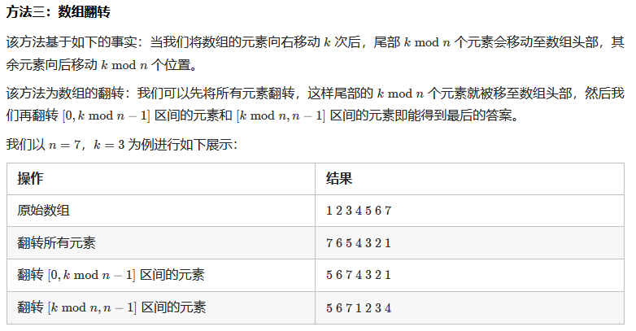

# [189. 旋转数组](https://leetcode-cn.com/problems/rotate-array/)

给定一个数组，将数组中的元素向右移动 *k* 个位置，其中 *k* 是非负数。

**示例 1:**

```
输入: [1,2,3,4,5,6,7] 和 k = 3
输出: [5,6,7,1,2,3,4]
解释:
向右旋转 1 步: [7,1,2,3,4,5,6]
向右旋转 2 步: [6,7,1,2,3,4,5]
向右旋转 3 步: [5,6,7,1,2,3,4]
```

**示例 2:**

```
输入: [-1,-100,3,99] 和 k = 2
输出: [3,99,-1,-100]
解释: 
向右旋转 1 步: [99,-1,-100,3]
向右旋转 2 步: [3,99,-1,-100]
```

**说明:**

- 尽可能想出更多的解决方案，至少有三种不同的方法可以解决这个问题。
- 要求使用空间复杂度为 O(1) 的 **原地** 算法。

```c++
class Solution {
public:
    void rotate(std::vector<int> &nums, int k) {
        int n = nums.size();
        k = k % n;
        if (k == 0)return;
        int start = 0, l_len = n - k, r_len = k;
        while (start < n && l_len > 0 && r_len > 0) {
            int tmp = std::min(l_len, r_len);
            for (int i = start; i < start + tmp; ++i) {
                std::swap(nums[i], nums[i + l_len]);
            }
            start += tmp;
            if (l_len<r_len){
                l_len = tmp;
                r_len = r_len-tmp;
            }else{
                l_len = l_len-tmp;
                r_len = tmp;
            }
        }
    }
};
```

> 执行用时：12 ms, 在所有 C++ 提交中击败了50.50% 的用户
>
> 内存消耗：10 MB, 在所有 C++ 提交中击败了46.46% 的用户

看题解之我是菜鸡



```c++
class Solution {
public:
    void reverse(vector<int>& nums, int start, int end) {
        while (start < end) {
            swap(nums[start], nums[end]);
            start += 1;
            end -= 1;
        }
    }

    void rotate(vector<int>& nums, int k) {
        k %= nums.size();
        reverse(nums, 0, nums.size() - 1);
        reverse(nums, 0, k - 1);
        reverse(nums, k, nums.size() - 1);
    }
};
```


