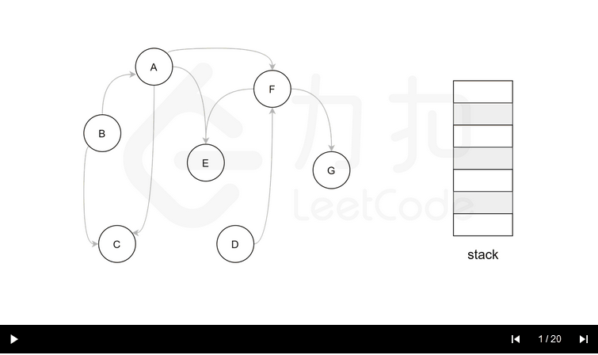

# [210. 课程表 II](https://leetcode-cn.com/problems/course-schedule-ii/)

现在你总共有 *n* 门课需要选，记为 `0` 到 `n-1`。

在选修某些课程之前需要一些先修课程。 例如，想要学习课程 0 ，你需要先完成课程 1 ，我们用一个匹配来表示他们: `[0,1]`

给定课程总量以及它们的先决条件，返回你为了学完所有课程所安排的学习顺序。

可能会有多个正确的顺序，你只要返回一种就可以了。如果不可能完成所有课程，返回一个空数组。

**示例 1:**

```
输入: 2, [[1,0]] 
输出: [0,1]
解释: 总共有 2 门课程。要学习课程 1，你需要先完成课程 0。因此，正确的课程顺序为 [0,1] 。
```

**示例 2:**

```
输入: 4, [[1,0],[2,0],[3,1],[3,2]]
输出: [0,1,2,3] or [0,2,1,3]
解释: 总共有 4 门课程。要学习课程 3，你应该先完成课程 1 和课程 2。并且课程 1 和课程 2 都应该排在课程 0 之后。
     因此，一个正确的课程顺序是 [0,1,2,3] 。另一个正确的排序是 [0,2,1,3] 。
```

**说明:**

1. 输入的先决条件是由**边缘列表**表示的图形，而不是邻接矩阵。详情请参见[图的表示法](http://blog.csdn.net/woaidapaopao/article/details/51732947)。
2. 你可以假定输入的先决条件中没有重复的边。

**提示:**

1. 这个问题相当于查找一个循环是否存在于有向图中。如果存在循环，则不存在拓扑排序，因此不可能选取所有课程进行学习。
2. [通过 DFS 进行拓扑排序](https://www.coursera.org/specializations/algorithms) - 一个关于Coursera的精彩视频教程（21分钟），介绍拓扑排序的基本概念。
3. 拓扑排序也可以通过 [BFS](https://baike.baidu.com/item/宽度优先搜索/5224802?fr=aladdin&fromid=2148012&fromtitle=广度优先搜索) 完成。

关于这个图给我整怕了，直接看的题解

算法
对于图中的任意一个节点，它在搜索的过程中有三种状态，即：

- 【未搜索】：我们还没有搜索到这个节点；
- 【搜索中】：我们搜索过这个节点，但还没有回溯到该节点，即该节点还没有入栈，还有相邻的节点没有搜索完成）；
- 【已完成】：我们搜索过并且回溯过这个节点，即该节点已经入栈，并且所有该节点的相邻节点都出现在栈的更底部的位置，满足拓扑排序的要求。


通过上述的三种状态，我们就可以给出使用深度优先搜索得到拓扑排序的算法流程，在每一轮的搜索搜索开始时，我们任取一个[未搜索]的节点开始进行深度优先搜索。

- 我们将当前搜索的节点u标记为【搜索中】，遍历该节点的每一个相邻节点v：
  - 如果v为【未搜索】，那么我们开始搜索v，待搜索完成回溯到u；
  - 如果v为【搜索中】，那么我们就找到了图中的一个环，因此是不存在拓扑排序的；
  - 如果v为【已完成】，那么说明v已经在栈中了，而u还不在栈中，因此u无论何时入栈都不会影响到（u，v）之前的拓扑关系，以及不用进行任何操作。
- 当u的所有相邻节点都为[已完成]时，我们将u放入栈中，并将其标记为【已完成】。
- 在整个深度优先搜索的过程结束后，如果我们没有找到图中的环，那么栈中存储这所有的n个节点，从栈顶到栈底的顺序即为一种拓扑排序。

下面的幻灯片给出了深度优先搜索的可视化流程。图中的【白色】【黄色】【绿色】节点分别表示【未搜索】【搜索中】【已完成】的状态。



```c++
class Solution {
private:
    // 存储有向图
    vector<vector<int>> edges;
    // 标记每个节点的状态：0=未搜索，1=搜索中，2=已完成
    vector<int> visited;
    // 用数组来模拟栈，下标 0 为栈底，n-1 为栈顶
    vector<int> result;
    // 判断有向图中是否有环
    bool invalid;

public:
    void dfs(int u) {
        // 将节点标记为「搜索中」
        visited[u] = 1;
        // 搜索其相邻节点
        // 只要发现有环，立刻停止搜索
        for (int v: edges[u]) {
            // 如果「未搜索」那么搜索相邻节点
            if (visited[v] == 0) {
                dfs(v);
                if (invalid) {
                    return;
                }
            }
            // 如果「搜索中」说明找到了环
            else if (visited[v] == 1) {
                invalid = true;
                return;
            }
        }
        // 将节点标记为「已完成」
        visited[u] = 2;
        // 将节点入栈
        result.push_back(u);
    }

    vector<int> findOrder(int numCourses, vector<vector<int>>& prerequisites) {
        edges.resize(numCourses);
        visited.resize(numCourses);
        for (const auto& info: prerequisites) {
            edges[info[1]].push_back(info[0]);
        }
        // 每次挑选一个「未搜索」的节点，开始进行深度优先搜索
        for (int i = 0; i < numCourses && !invalid; ++i) {
            if (!visited[i]) {
                dfs(i);
            }
        }
        if (invalid) {
            return {};
        }
        // 如果没有环，那么就有拓扑排序
        // 注意下标 0 为栈底，因此需要将数组反序输出
        reverse(result.begin(), result.end());
        return result;
    }
};
```
