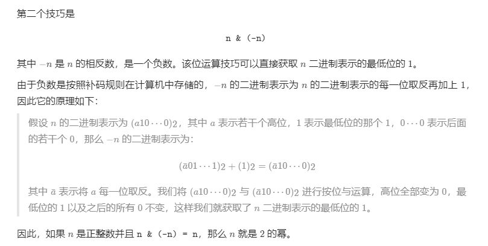

# 231. 2 的幂
给你一个整数 `n`，请你判断该整数是否是 2 的幂次方。如果是，返回 `true` ；否则，返回 `false` 。

如果存在一个整数 `x` 使得 `n == 2 ^ x` ，则认为 `n` 是 2 的幂次方。

 

**示例 1：**

**输入：**n = 1
**输出：**true
**解释：**2 ^ 0 = 1


**示例 2：**

**输入：**n = 16
**输出：**true
**解释：**2 ^ 4 = 16


**示例 3：**

**输入：**n = 3
**输出：**false


**示例 4：**

**输入：**n = 4
**输出：**true


**示例 5：**

**输入：**n = 5
**输出：**false


**提示：**


- `-2 ^ 31 <= n <= 2 ^ 31 - 1`


**进阶：**你能够不使用循环/递归解决此问题吗？

## 我的代码

```c++
class Solution {
public:
    bool isPowerOfTwo(int n) {
        return n>0 && (n&(n-1))==0;

    }
};
```
> 执行用时：4 ms, 在所有 C++ 提交中击败了43.12%的用户
>
> 内存消耗：5.8 MB, 在所有 C++ 提交中击败了47.45%的用户

## 题解

```c++
class Solution {
public:
    bool isPowerOfTwo(int n) {
        return n > 0 && (n & -n) == n;
    }
};

作者：LeetCode-Solution
链接：https://leetcode-cn.com/problems/power-of-two/solution/2de-mi-by-leetcode-solution-rny3/
来源：力扣（LeetCode）
著作权归作者所有。商业转载请联系作者获得授权，非商业转载请注明出处。
```


```c++
class Solution {
private:
    static constexpr int BIG = 1 << 30;

public:
    bool isPowerOfTwo(int n) {
        return n > 0 && BIG % n == 0;
    }
};

作者：LeetCode-Solution
链接：https://leetcode-cn.com/problems/power-of-two/solution/2de-mi-by-leetcode-solution-rny3/
来源：力扣（LeetCode）
著作权归作者所有。商业转载请联系作者获得授权，非商业转载请注明出处。
```

## 标签
[0.典型题.md](0.典型题.md)
[231.2的幂.md](231.2的幂.md)

逻辑运算

## 知识点



