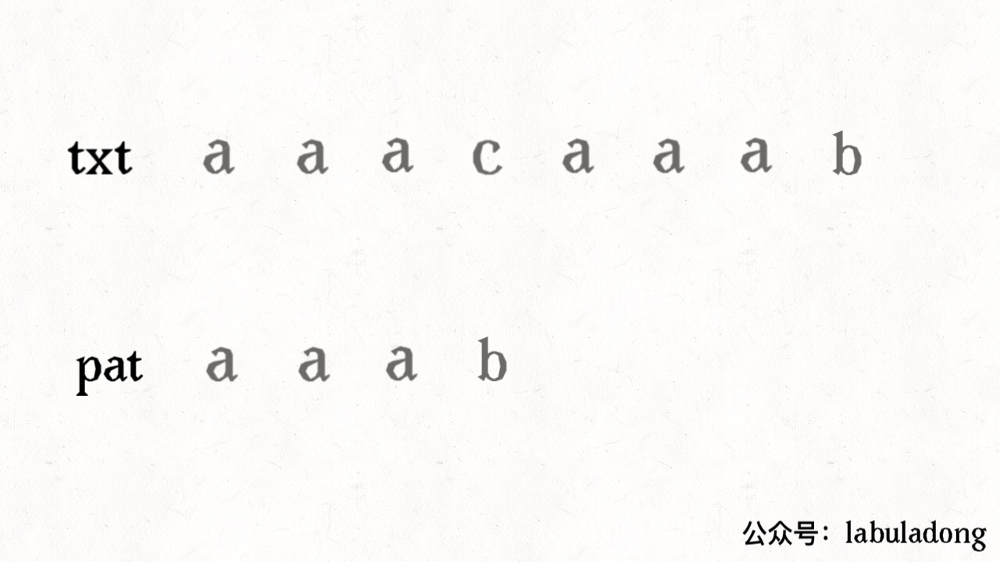
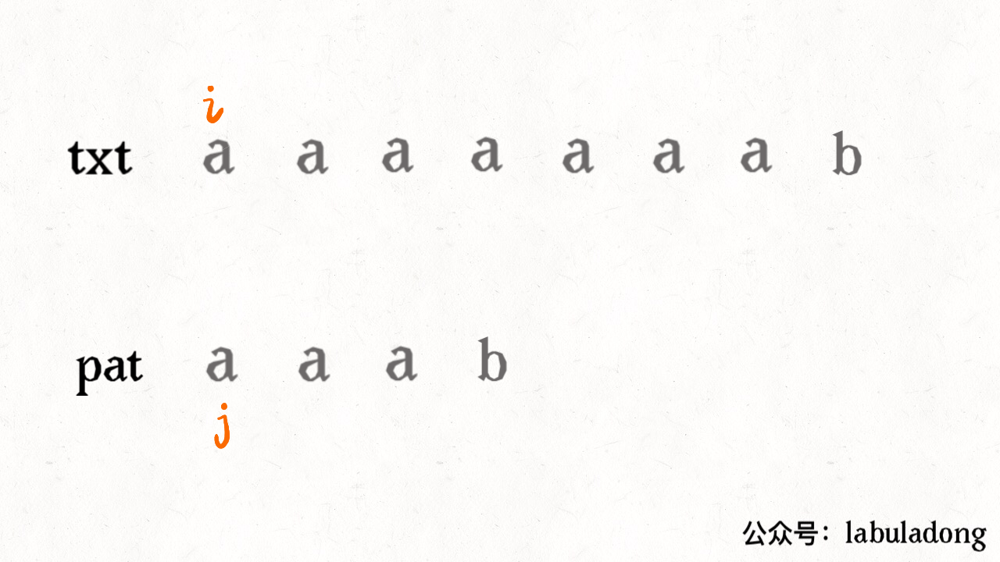
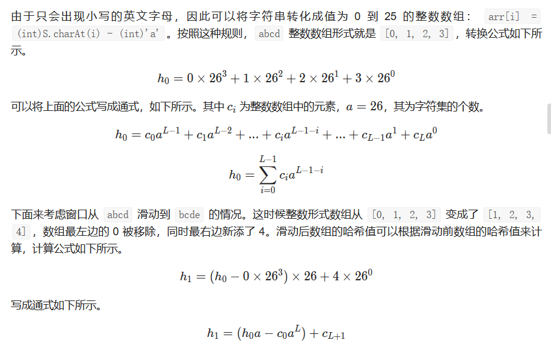

# [28. 实现 strStr()](https://leetcode-cn.com/problems/implement-strstr/)

实现 [strStr()](https://baike.baidu.com/item/strstr/811469) 函数。

给定一个 haystack 字符串和一个 needle 字符串，在 haystack 字符串中找出 needle 字符串出现的第一个位置 (从0开始)。如果不存在，则返回 **-1**。

**示例 1:**

```
输入: haystack = "hello", needle = "ll"
输出: 2
```

**示例 2:**

```
输入: haystack = "aaaaa", needle = "bba"
输出: -1
```

**说明:**

当 `needle` 是空字符串时，我们应当返回什么值呢？这是一个在面试中很好的问题。

对于本题而言，当 `needle` 是空字符串时我们应当返回 0 。这与C语言的 [strstr()](https://baike.baidu.com/item/strstr/811469) 以及 Java的 [indexOf()](https://docs.oracle.com/javase/7/docs/api/java/lang/String.html#indexOf(java.lang.String)) 定义相符。

```c++
class Solution {
public:
    int strStr(std::string haystack, std::string needle) {
        if (needle.empty())return 0;
        int n = haystack.size() - needle.size();
        for (int i = 0; i <= n; ++i) {
            bool flag = true;
            for (int j = 0, k = i; j < needle.size(); ++j,++k) {
                if (haystack[k] != needle[j]) {
                    flag = false;
                    break;
                }
            }
            if (flag)return i;
        }
        return -1;
    }
};
```

> 执行用时：4 ms, 在所有 C++ 提交中击败了81.14% 的用户
>
> 内存消耗：6.8 MB, 在所有 C++ 提交中击败了79.15% 的用户

题解有俩牛逼算法：1.kmp 2.生成哈希码

kmp：





哈希



这个数可能特别大，所以需要取个模（然而不懂为啥取2^31）避免溢出。


