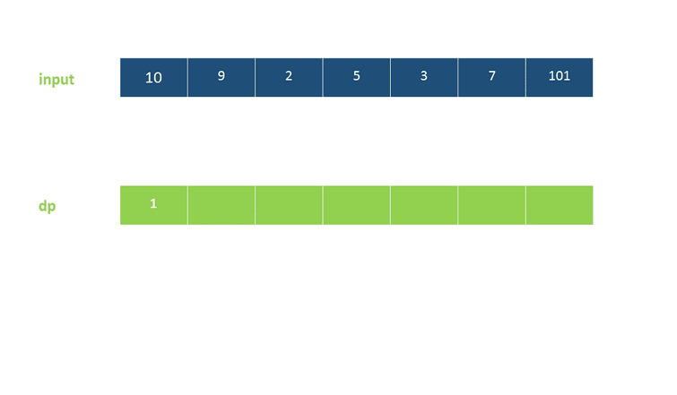

# [300. 最长上升子序列](https://leetcode-cn.com/problems/longest-increasing-subsequence/)

给定一个无序的整数数组，找到其中最长上升子序列的长度。

**示例:**

```
输入: [10,9,2,5,3,7,101,18]
输出: 4 
解释: 最长的上升子序列是 [2,3,7,101]，它的长度是 4。
```

**说明:**

- 可能会有多种最长上升子序列的组合，你只需要输出对应的长度即可。
- 你算法的时间复杂度应该为 O(*n2*) 。

**进阶:** 你能将算法的时间复杂度降低到 O(*n* log *n*) 吗?


看这个指定是用到二分了，然而，，我没想到咋用

可以先排序，然后找逆序的，逆序的指定不行，排除之后剩下最多的那个就对了吧


思路：

O(n2)的话，那就是遍历再遍历，建一个表，存每一个数他后面比他大的数

我傻了，居然用递归遍历了一个

看题解有两种：

### 1.**动态规划**

自己理解就是找递推关系，随着遍历进行变化，使一次遍历可以解决整个问题。

dp表示前i个数中的最长上升子序长度



### 2.**动态+贪心+二分法**

整个算法流程为：
设当前已求出的最长上升子序列的长度为len（初始时为1），从前往后遍历数组nums，在遍历到nums[i]时：

- ​	如果nums[i]>d[len]，则直接加入到d数组末尾，并更新len=len+1；
- ​	否则，在d数组中二分查找，找到第一个比nums[i]小的数d[k]，并更新d[k+1]=nums[i]。

以输入序列 [0,8,4,12,2] 为例：

    第一步插入 0，d=[0]；
    
    第二步插入 8，d=[0,8]；
    
    第三步插入 4，d=[0,4]；
    
    第四步插入 12，d=[0,4,12]；
    
    第五步插入 2，d=[0,2,12]。

最终得到最大递增子序列长度为 3。


