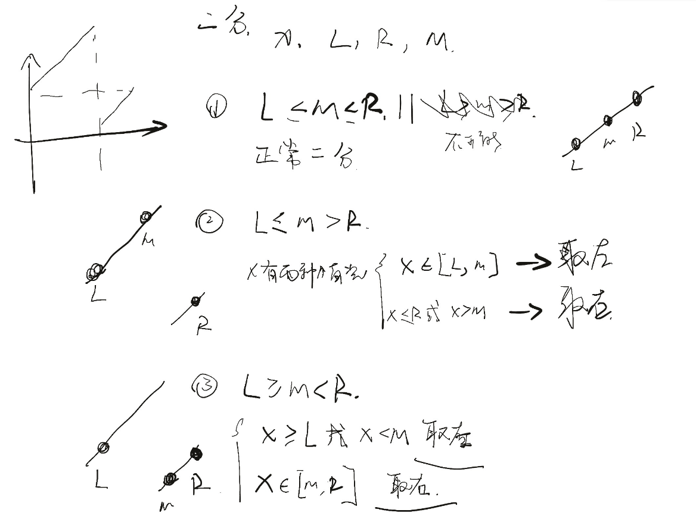

# [33. 搜索旋转排序数组](https://leetcode-cn.com/problems/search-in-rotated-sorted-array/)

假设按照升序排序的数组在预先未知的某个点上进行了旋转。

( 例如，数组 `[0,1,2,4,5,6,7]` 可能变为 `[4,5,6,7,0,1,2]` )。

搜索一个给定的目标值，如果数组中存在这个目标值，则返回它的索引，否则返回 `-1` 。

你可以假设数组中不存在重复的元素。

你的算法时间复杂度必须是 *O*(log *n*) 级别。

**示例 1:**

```
输入: nums = [4,5,6,7,0,1,2], target = 0
输出: 4
```

**示例 2:**

```
输入: nums = [4,5,6,7,0,1,2], target = 3
输出: -1
```

思路：



```c++
class Solution {
private:
    void keep_left(int &L, int &M, int &R) {
        R = M;
        M = (L + M) / 2;

    }

    void keep_right(int &L, int &M, int &R) {
        L = M;
        M = (R + M) / 2 ;

    }

public:
    int search(std::vector<int> &nums, int target) {
        int L = 0, R = nums.size() - 1, M = (L + R) / 2;
        int l, r, m;
        if (0 == R) {
            if (target == nums[0])return 0;
            else return -1;
        }
        while (L < R) {
            l = nums[L], r = nums[R], m = nums[M];
            if (target == l)return L;
            if (target == m)return M;
            if (target == r)return R;
            if (R - L == 1) return -1;

            if (l <= m) {
                if (m <= r) {
                    if (target < l || target > r)return -1;
                    if (target < m)keep_left(L, M, R);
                    else keep_right(L, M, R);
                } else {
                    if (target < l && target > r)return -1;
                    if (target > l && target < m)keep_left(L, M, R);
                    else keep_right(L, M, R);
                }
            } else {
                if (target > m && target < r)keep_right(L, M, R);
                else keep_left(L, M, R);
            }
        }
        return -1;
    }
};
```

> 执行用时 :0 ms, 在所有 C++ 提交中击败了100.00% 的用户
>
> 内存消耗 :6.6 MB, 在所有 C++ 提交中击败了100.00%的用户

官方题解基本就这样


