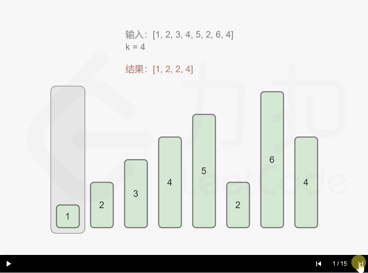

# [402. 移掉K位数字](https://leetcode-cn.com/problems/remove-k-digits/)

给定一个以字符串表示的非负整数 *num*，移除这个数中的 *k* 位数字，使得剩下的数字最小。

**注意:**

- *num* 的长度小于 10002 且 ≥ *k。*
- *num* 不会包含任何前导零。

**示例 1 :**

```
输入: num = "1432219", k = 3
输出: "1219"
解释: 移除掉三个数字 4, 3, 和 2 形成一个新的最小的数字 1219。
```

**示例 2 :**

```
输入: num = "10200", k = 1
输出: "200"
解释: 移掉首位的 1 剩下的数字为 200. 注意输出不能有任何前导零。
```

示例 **3 :**

```
输入: num = "10", k = 2
输出: "0"
解释: 从原数字移除所有的数字，剩余为空就是0。
```

```c++
class Solution {
public:
    std::string removeKdigits(std::string num, int k) {
        std::string rst;
        char tmp = '9';
        int loc = 0, n = num.size(), left = 0, count = 0;
        while (k > 0) {
            tmp = '9';
            int last_loc = 0,min_loc = 0;
            for (int i = 0; i < k + 1; ++i) {
                last_loc = i + loc;
                if (last_loc >= n) {
                    if (rst.empty())return "0";
                    else return rst;
                }
                if (num[last_loc] < tmp) {
                    tmp = num[last_loc];
                    min_loc = last_loc;
                }
            }
            k -= min_loc - loc;
            loc = min_loc + 1;
            if (!rst.empty() || tmp != '0')rst.push_back(tmp);
        }
        for (int i = loc; i < n; ++i) {
            if (!rst.empty() || num[i] != '0')rst.push_back(num[i]);
        }
        if (rst.empty())return "0";
        else return rst;
    }
};
```

> 执行用时：12 ms, 在所有 C++ 提交中击败了36.82% 的用户
>
> 内存消耗：7 MB, 在所有 C++ 提交中击败了56.74% 的用户

题解的思路比较好，由于删除操作觉得麻烦就没想到。



```c++
class Solution {
public:
    string removeKdigits(string num, int k) {
        vector<char> stk;
        for (auto& digit: num) {
            while (stk.size() > 0 && stk.back() > digit && k) {
                stk.pop_back();
                k -= 1;
            }
            stk.push_back(digit);
        }

        for (; k > 0; --k) {
            stk.pop_back();
        }

        string ans = "";
        bool isLeadingZero = true;
        for (auto& digit: stk) {
            if (isLeadingZero && digit == '0') {
                continue;
            }
            isLeadingZero = false;
            ans += digit;
        }
        return ans == "" ? "0" : ans;
    }
};
```
