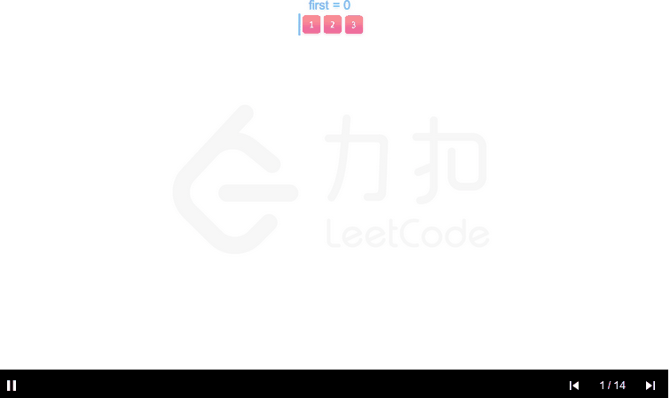

# [46. 全排列](https://leetcode-cn.com/problems/permutations/)

给定一个 **没有重复** 数字的序列，返回其所有可能的全排列。

**示例:**

```
输入: [1,2,3]
输出:
[
  [1,2,3],
  [1,3,2],
  [2,1,3],
  [2,3,1],
  [3,1,2],
  [3,2,1]
]
```

```c++
class Solution {
private:
    std::vector<std::vector<int>> record;
    void recursion(std::vector<int> head,std::vector<int> rest){
        if(rest.empty()) record.push_back(head);
        for(auto i=0;i<rest.size();i++){
            auto temp_rest = rest;
            temp_rest.erase(temp_rest.begin()+i);
            auto temp_head = head;
            temp_head.push_back(rest[i]);
            recursion(temp_head,temp_rest);
        }
    }

public:
    std::vector<std::vector<int>> permute(std::vector<int>& nums) {
        record = {};
        recursion({},nums);
        return record;
    }
};
```

>执行用时 :12 ms, 在所有 C++ 提交中击败了22.13% 的用户
>
>内存消耗 :8.9 MB, 在所有 C++ 提交中击败了98.41%的用户

题解这个不用改数组长度



```c++
class Solution {
public:
    void backtrack(vector<vector<int>>& res, vector<int>& output, int first, int len){
        // 所有数都填完了
        if (first == len) {
            res.emplace_back(output);
            return;
        }
        for (int i = first; i < len; ++i) {
            // 动态维护数组
            swap(output[i], output[first]);
            // 继续递归填下一个数
            backtrack(res, output, first + 1, len);
            // 撤销操作
            swap(output[i], output[first]);
        }
    }
    vector<vector<int>> permute(vector<int>& nums) {
        vector<vector<int> > res;
        backtrack(res, nums, 0, (int)nums.size());
        return res;
    }
};
```
