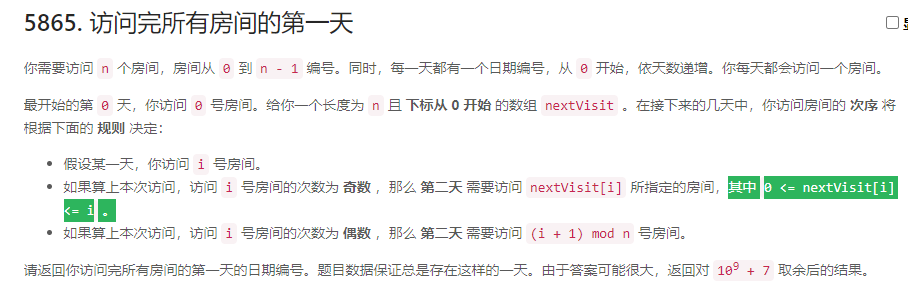
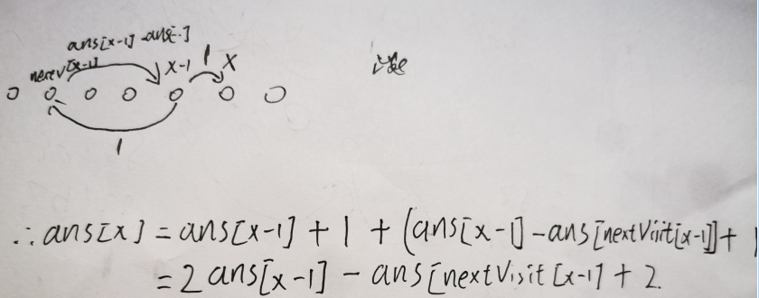

### 5865. 访问完所有房间的第一天

 显示英文描述

 

[我的提交](https://leetcode-cn.com/contest/weekly-contest-257/problems/first-day-where-you-have-been-in-all-the-rooms/submissions/)[返回竞赛](https://leetcode-cn.com/contest/weekly-contest-257/)

- **通过的用户数**300
- **尝试过的用户数**1051
- **用户总通过次数**316
- **用户总提交次数**1785
- **题目难度****Medium**

你需要访问 `n` 个房间，房间从 `0` 到 `n - 1` 编号。同时，每一天都有一个日期编号，从 `0` 开始，依天数递增。你每天都会访问一个房间。

最开始的第 `0` 天，你访问 `0` 号房间。给你一个长度为 `n` 且 **下标从 0 开始** 的数组 `nextVisit` 。在接下来的几天中，你访问房间的 **次序** 将根据下面的 **规则** 决定：

- 假设某一天，你访问 `i` 号房间。
- 如果算上本次访问，访问 `i` 号房间的次数为 **奇数** ，那么 **第二天** 需要访问 `nextVisit[i]` 所指定的房间，其中 `0 <= nextVisit[i] <= i` 。
- 如果算上本次访问，访问 `i` 号房间的次数为 **偶数** ，那么 **第二天** 需要访问 `(i + 1) mod n` 号房间。

请返回你访问完所有房间的第一天的日期编号。题目数据保证总是存在这样的一天。由于答案可能很大，返回对 `109 + 7` 取余后的结果。

 

**示例 1：**

```
输入：nextVisit = [0,0]
输出：2
解释：
- 第 0 天，你访问房间 0 。访问 0 号房间的总次数为 1 ，次数为奇数。
  下一天你需要访问房间的编号是 nextVisit[0] = 0
- 第 1 天，你访问房间 0 。访问 0 号房间的总次数为 2 ，次数为偶数。
  下一天你需要访问房间的编号是 (0 + 1) mod 2 = 1
- 第 2 天，你访问房间 1 。这是你第一次完成访问所有房间的那天。
```

**示例 2：**

```
输入：nextVisit = [0,0,2]
输出：6
解释：
你每天访问房间的次序是 [0,0,1,0,0,1,2,...] 。
第 6 天是你访问完所有房间的第一天。
```

**示例 3：**

```
输入：nextVisit = [0,1,2,0]
输出：6
解释：
你每天访问房间的次序是 [0,0,1,1,2,2,3,...] 。
第 6 天是你访问完所有房间的第一天。
```

 

**提示：**

- `n == nextVisit.length`
- `2 <= n <= 105`
- `0 <= nextVisit[i] <= i`

```c++
class Solution {
public:
    int firstDayBeenInAllRooms(vector<int>& nextVisit) {
        int day = 0;
        int n = nextVisit.size();
        vector<int> rcd(n,0);
        int last = n;
        int loc = 0;
        while(last>0){
            if(rcd[loc]==0){
                last--;
            }
            rcd[loc]++;
            if(rcd[loc]>2)rcd[loc]=1;
            if(rcd[loc]==1){
                loc = nextVisit[loc];
            }else{
                loc = (loc+1)%n;
            }
            day++;
            if(day>1000000007)day%=1000000007;
        }
        return day-1;
    }
};
```

大佬的

```c++
int f[100005];//进入新房间需要的
int s[100005];
int MOD = 1e9 + 7;

class Solution {
public:
    int firstDayBeenInAllRooms(vector<int>& a) {
        int n = a.size();
        s[0] = 2;
        for (int i = 1; i < n - 1; i++) {
            int now = 2 + s[i - 1];
            if (a[i] > 0) {//不回到0房间
                now = (now - s[a[i] - 1] + MOD) % MOD;
            }
            f[i] = now;
            s[i] = (s[i - 1] + f[i]) % MOD;
        }
        return s[n - 2];
    }
};
```



以后读题再不认真我就是个。。。。。

所以这边所有的房间到了之后都要往回倒一次，所以必然会访问到偶数次，所以

根据题意可知 访问到x点时， 前面所有的点的访问次数必为偶数
设 ans[x] 为第一次访问到x时 所需要的天数
那么ans[x] - ans[y] y < x就是 从第一次访问到y点 到 第一次访问 x 点 需要的天数



