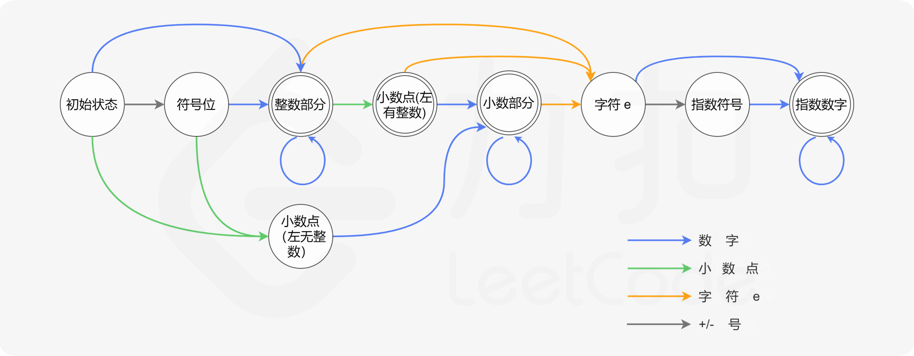

# 65. 有效数字
**有效数字**（按顺序）可以分成以下几个部分：

<ol>

- 一个 **小数** 或者 **整数**

- （可选）一个 `'e'` 或 `'E'` ，后面跟着一个 **整数**
</ol>

**小数**（按顺序）可以分成以下几个部分：

<ol>

- （可选）一个符号字符（`'+'` 或 `'-'`）

- 下述格式之一：
<ol>

- 至少一位数字，后面跟着一个点 `'.'`

- 至少一位数字，后面跟着一个点 `'.'` ，后面再跟着至少一位数字

- 一个点 `'.'` ，后面跟着至少一位数字
</ol>

</ol>

**整数**（按顺序）可以分成以下几个部分：

<ol>

- （可选）一个符号字符（`'+'` 或 `'-'`）

- 至少一位数字
</ol>

部分有效数字列举如下：


- `["2", "0089", "-0.1", "+3.14", "4.", "-.9", "2e10", "-90E3", "3e+7", "+6e-1", "53.5e93", "-123.456e789"]`


部分无效数字列举如下：


- `["abc", "1a", "1e", "e3", "99e2.5", "--6", "-+3", "95a54e53"]`


给你一个字符串 `s` ，如果 `s` 是一个 **有效数字** ，请返回 `true` 。

 

**示例 1：**

**输入：**s = "0"
**输出：**true


**示例 2：**

**输入：**s = "e"
**输出：**false


**示例 3：**

**输入：**s = "."
**输出：**false


**示例 4：**

**输入：**s = ".1"
**输出：**true


**提示：**


- `1 <= s.length <= 20`

- `s` 仅含英文字母（大写和小写），数字（`0-9`），加号 `'+'` ，减号 `'-'` ，或者点 `'.'` 。


## 我的代码

```c++
class Solution {
    void deleteAdd(string &s) {
        if (s[0] == '+' || s[0] == '-') {
            s = s.substr(1);
        }
    }
    bool isAllNum(string &s) {
        for (char c : s) {
            if (c < '0' || c > '9')
                return false;
        }
        return true;
    }

  public:
    bool isNumber(string s) {
        // find e/E
        int ie = -1;
        int n = s.size();
        for (int i = 0; i < n; ++i) {
            if (s[i] == 'e' || s[i] == 'E') {
                ie = i;
                break;
            }
        }

        if (ie != -1) { // found e
            string a = s.substr(0, ie);
            deleteAdd(a);
            if (a.empty())
                return false;
            // find dot
            int idot = -1;
            for (int i = 0; i < a.size(); ++i) {
                if (a[i] == '.') {
                    idot = i;
                    break;
                }
            }
            if (idot != -1) { // found dot
                string a1 = a.substr(0, idot), a2 = a.substr(idot + 1);
                if (!isAllNum(a1) || !isAllNum(a2) ||
                    (a1.empty() && a2.empty()))
                    return false;
            } else { // no dot
                if (!isAllNum(a))
                    return false;
            }
            string b = s.substr(ie + 1);
            deleteAdd(b);
            if (b.empty())
                return false;
            if (!isAllNum(b))
                return false;
        } else {
            deleteAdd(s);
            int idot = -1;
            for (int i = 0; i < s.size(); ++i) {
                if (s[i] == '.') {
                    idot = i;
                    break;
                }
            }
            if (idot != -1) { // found dot
                string s1 = s.substr(0, idot), s2 = s.substr(idot + 1);
                if (!isAllNum(s1) || !isAllNum(s2) ||
                    (s1.empty() && s2.empty()))
                    return false;
            } else { // no dot
                if (!isAllNum(s))
                    return false;
            }
        }
        return true;
    }
};
```
> 执行用时：8 ms, 在所有 C++ 提交中击败了40.00%的用户
>
> 内存消耗：6 MB, 在所有 C++ 提交中击败了37.72%的用户

## 题解



```c++
class Solution {
public:
    enum State {
        STATE_INITIAL,
        STATE_INT_SIGN,
        STATE_INTEGER,
        STATE_POINT,
        STATE_POINT_WITHOUT_INT,
        STATE_FRACTION,
        STATE_EXP,
        STATE_EXP_SIGN,
        STATE_EXP_NUMBER,
        STATE_END
    };

    enum CharType {
        CHAR_NUMBER,
        CHAR_EXP,
        CHAR_POINT,
        CHAR_SIGN,
        CHAR_ILLEGAL
    };

    CharType toCharType(char ch) {
        if (ch >= '0' && ch <= '9') {
            return CHAR_NUMBER;
        } else if (ch == 'e' || ch == 'E') {
            return CHAR_EXP;
        } else if (ch == '.') {
            return CHAR_POINT;
        } else if (ch == '+' || ch == '-') {
            return CHAR_SIGN;
        } else {
            return CHAR_ILLEGAL;
        }
    }

    bool isNumber(string s) {
        unordered_map<State, unordered_map<CharType, State>> transfer{
            {
                STATE_INITIAL, {
                    {CHAR_NUMBER, STATE_INTEGER},
                    {CHAR_POINT, STATE_POINT_WITHOUT_INT},
                    {CHAR_SIGN, STATE_INT_SIGN}
                }
            }, {
                STATE_INT_SIGN, {
                    {CHAR_NUMBER, STATE_INTEGER},
                    {CHAR_POINT, STATE_POINT_WITHOUT_INT}
                }
            }, {
                STATE_INTEGER, {
                    {CHAR_NUMBER, STATE_INTEGER},
                    {CHAR_EXP, STATE_EXP},
                    {CHAR_POINT, STATE_POINT}
                }
            }, {
                STATE_POINT, {
                    {CHAR_NUMBER, STATE_FRACTION},
                    {CHAR_EXP, STATE_EXP}
                }
            }, {
                STATE_POINT_WITHOUT_INT, {
                    {CHAR_NUMBER, STATE_FRACTION}
                }
            }, {
                STATE_FRACTION,
                {
                    {CHAR_NUMBER, STATE_FRACTION},
                    {CHAR_EXP, STATE_EXP}
                }
            }, {
                STATE_EXP,
                {
                    {CHAR_NUMBER, STATE_EXP_NUMBER},
                    {CHAR_SIGN, STATE_EXP_SIGN}
                }
            }, {
                STATE_EXP_SIGN, {
                    {CHAR_NUMBER, STATE_EXP_NUMBER}
                }
            }, {
                STATE_EXP_NUMBER, {
                    {CHAR_NUMBER, STATE_EXP_NUMBER}
                }
            }
        };

        int len = s.length();
        State st = STATE_INITIAL;

        for (int i = 0; i < len; i++) {
            CharType typ = toCharType(s[i]);
            if (transfer[st].find(typ) == transfer[st].end()) {
                return false;
            } else {
                st = transfer[st][typ];
            }
        }
        return st == STATE_INTEGER || st == STATE_POINT || st == STATE_FRACTION || st == STATE_EXP_NUMBER || st == STATE_END;
    }
};

作者：LeetCode-Solution
链接：https://leetcode-cn.com/problems/valid-number/solution/you-xiao-shu-zi-by-leetcode-solution-298l/
来源：力扣（LeetCode）
著作权归作者所有。商业转载请联系作者获得授权，非商业转载请注明出处。
```

## 标签
[0.典型题.md](0.典型题.md)
[65.有效数字.md](65.有效数字.md)

自动机

## 知识点

自动机

## 易错测试用例

"."
"e9"
