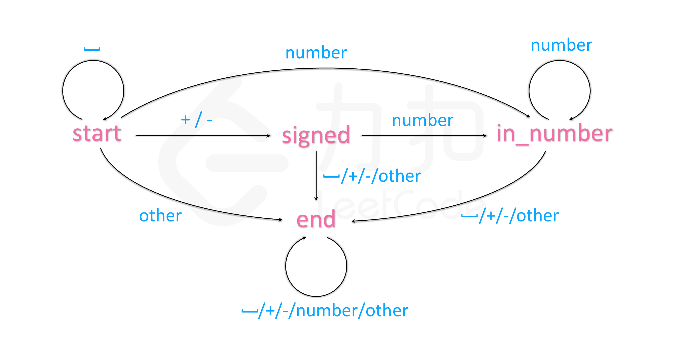

# 8.字符串转整数（`atoi`）

请你来实现一个 `atoi` 函数，使其能将字符串转换成整数。

首先，该函数会根据需要丢弃无用的开头空格字符，直到寻找到第一个非空格的字符为止。

当我们寻找到的第一个非空字符为正或者负号时，则将该符号与之后面尽可能多的连续数字组合起来，作为该整数的正负号；假如第一个非空字符是数字，则直接将其与之后连续的数字字符组合起来，形成整数。

该字符串除了有效的整数部分之后也可能会存在多余的字符，这些字符可以被忽略，它们对于函数不应该造成影响。

注意：假如该字符串中的第一个非空格字符不是一个有效整数字符、字符串为空或字符串仅包含空白字符时，则你的函数不需要进行转换。

在任何情况下，若函数不能进行有效的转换时，请返回 0。

说明：

假设我们的环境只能存储 32 位大小的有符号整数，那么其数值范围为 [−231,  231 − 1]。如果数值超过这个范围，请返回  INT_MAX (231 − 1) 或 INT_MIN (−231) 。

示例 1:

```
输入: "42"
输出: 42
```

示例 2:

```
输入: "   -42"
输出: -42
解释: 第一个非空白字符为 '-', 它是一个负号。
     我们尽可能将负号与后面所有连续出现的数字组合起来，最后得到 -42 。
```

示例 3:

```
输入: "4193 with words"
输出: 4193
解释: 转换截止于数字 '3' ，因为它的下一个字符不为数字。
```

示例 4:

```
输入: "words and 987"
输出: 0
解释: 第一个非空字符是 'w', 但它不是数字或正、负号。
     因此无法执行有效的转换。
```

示例 5:

```
输入: "-91283472332"
输出: -2147483648
解释: 数字 "-91283472332" 超过 32 位有符号整数范围。 
     因此返回 INT_MIN (−231) 。
```

测试用例：

```python
s = ' -01 dfaf'
s = ' + 1'
s = '-'
s = '42'
s = '-42'
s = 'words in 944'
s = "-91283472332"
s = "4193 with words"
s = '3.14159'
```

代码：

```
class Solution:
    def myAtoi(self, str: str) -> int:
        j = 0
        num = 0
        for i in str:
            if i is not ' ':
                str = str[j:]
                break
            j = j + 1
        if str.isnumeric():
            num = int(str)
        else:
            if str.__len__()>1:
                j = 0
                for i in str[1:]:
                    j = j + 1
                    if not i.isnumeric():
                        str = str[:j]
                        break
                if str.isnumeric(): num = int(str)
                if str.__len__() > 1:
                    if str[0] == '+': num = int(str[1:])
                    if str[0] == '-': num = int(str)
        if num > pow(2, 31) - 1:
            return 2147483647
        if num < -pow(2, 31):
            return -2147483648
        return num

```


>执行用时 :56 ms, 在所有 Python3 提交中击败了11.22% 的用户
>
>内存消耗 :13 MB, 在所有 Python3 提交中击败了49.12%的用户

题解：

自动机

 

建一个类，把所有情况列表输入，代码清晰工整。
```python
INT_MAX = 2 ** 31 - 1
INT_MIN = -2 ** 31

class Automaton:
    def __init__(self):
        self.state = 'start'
        self.sign = 1
        self.ans = 0
        self.table = {
            'start': ['start', 'signed', 'in_number', 'end'],
            'signed': ['end', 'end', 'in_number', 'end'],
            'in_number': ['end', 'end', 'in_number', 'end'],
            'end': ['end', 'end', 'end', 'end'],
        }
        
    def get_col(self, c):
        if c.isspace():
            return 0
        if c == '+' or c == '-':
            return 1
        if c.isdigit():
            return 2
        return 3

    def get(self, c):
        self.state = self.table[self.state][self.get_col(c)]
        if self.state == 'in_number':
            self.ans = self.ans * 10 + int(c)
            self.ans = min(self.ans, INT_MAX) if self.sign == 1 else min(self.ans, -INT_MIN)
        elif self.state == 'signed':
            self.sign = 1 if c == '+' else -1

class Solution:
    def myAtoi(self, str: str) -> int:
        automaton = Automaton()
        for c in str:
            automaton.get(c)
        return automaton.sign * automaton.ans
```

虽然很长，但可读性强，很工整。

