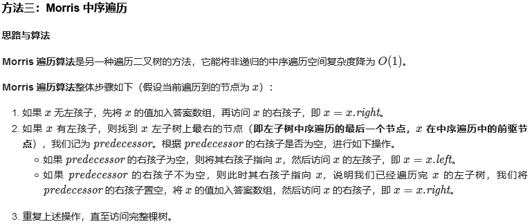
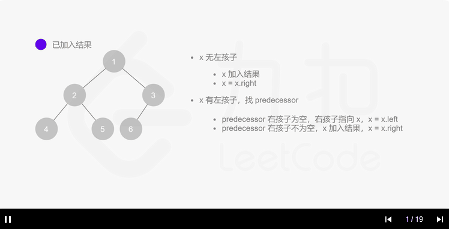

# [94. 二叉树的中序遍历](https://leetcode-cn.com/problems/binary-tree-inorder-traversal/)

给定一个二叉树，返回它的*中序* 遍历。

**示例:**

```
输入: [1,null,2,3]
   1
    \
     2
    /
   3

输出: [1,3,2]
```

**进阶:** 递归算法很简单，你可以通过迭代算法完成吗？

```c++
/**
 * Definition for a binary tree node.
 * struct TreeNode {
 *     int val;
 *     TreeNode *left;
 *     TreeNode *right;
 *     TreeNode(int x) : val(x), left(NULL), right(NULL) {}
 * };
 */
class Solution {
public:
    std::vector<int> inorderTraversal(TreeNode *root) {
        std::stack<TreeNode*> stk;
        std::vector<int> rst;
        stk.push(root);
        bool back = false;
        while (!stk.empty()){
            TreeNode *tmp = stk.top();
            if (tmp == nullptr){
                stk.pop();
            }else if(tmp->left== nullptr||back){
                rst.push_back(tmp->val);
                stk.pop();
                back = true;
                if (tmp->right!= nullptr){
                    stk.push(tmp->right);
                    back = false;
                }
            }else{
                stk.push(tmp->left);
                back = false;
            }
        }
        return rst;
    }
};
```

> 执行用时：0 ms, 在所有 C++ 提交中击败了100.00% 的用户
>
> 内存消耗：7.2 MB, 在所有 C++ 提交中击败了39.85% 的用户

### Morris中序遍历





```c++
class Solution {
public:
    vector<int> inorderTraversal(TreeNode* root) {
        vector<int> res;
        TreeNode *predecessor = nullptr;

        while (root != nullptr) {
            if (root->left != nullptr) {
                // predecessor 节点就是当前 root 节点向左走一步，然后一直向右走至无法走为止
                predecessor = root->left;
                while (predecessor->right != nullptr && predecessor->right != root) {
                    predecessor = predecessor->right;
                }
                
                // 让 predecessor 的右指针指向 root，继续遍历左子树
                if (predecessor->right == nullptr) {
                    predecessor->right = root;
                    root = root->left;
                }
                // 说明左子树已经访问完了，我们需要断开链接
                else {
                    res.push_back(root->val);
                    predecessor->right = nullptr;
                    root = root->right;
                }
            }
            // 如果没有左孩子，则直接访问右孩子
            else {
                res.push_back(root->val);
                root = root->right;
            }
        }
        return res;
    }
};
```


