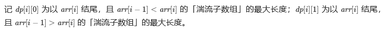

# [978. 最长湍流子数组](https://leetcode-cn.com/problems/longest-turbulent-subarray/)

当 `A` 的子数组 `A[i], A[i+1], ..., A[j]` 满足下列条件时，我们称其为*湍流子数组*：

- 若 `i <= k < j`，当 `k` 为奇数时， `A[k] > A[k+1]`，且当 `k` 为偶数时，`A[k] < A[k+1]`；
- **或** 若 `i <= k < j`，当 `k` 为偶数时，`A[k] > A[k+1]` ，且当 `k` 为奇数时， `A[k] < A[k+1]`。

也就是说，如果比较符号在子数组中的每个相邻元素对之间翻转，则该子数组是湍流子数组。

返回 `A` 的最大湍流子数组的**长度**。

 

**示例 1：**

```
输入：[9,4,2,10,7,8,8,1,9]
输出：5
解释：(A[1] > A[2] < A[3] > A[4] < A[5])
```

**示例 2：**

```
输入：[4,8,12,16]
输出：2
```

**示例 3：**

```
输入：[100]
输出：1
```

 

**提示：**

1. `1 <= A.length <= 40000`
2. `0 <= A[i] <= 10^9`

```c++
class Solution {
public:
    int maxTurbulenceSize(std::vector<int> &arr) {
        if (arr.size() < 2)return arr.size();
        if (arr.size() == 2)return arr[0] == arr[1] ? 1 : 2;
        //动态规划，记录以当前数结尾的最后一个符号与长度，记录最长的长度
        int rst = 1, tmp = 1;
        int state = 0;//0表示无状态，1表示小于号，2表示大于号
        int n = arr.size();
        for (int i = 1; i < n; ++i) {
            if(arr[i]==arr[i-1]){//断了，就记录前面的
                if (tmp>rst)rst = tmp;
                tmp = 1;
                state = 0;
            }else if(arr[i]<arr[i-1]){
                if (state==1){//断了，就记录前面的
                    if (tmp>rst)rst = tmp;
                    tmp = 2;
                }else{//继续
                    tmp++;
                    state = 1;
                }
            }else{
                if(state==2){//断了，就记录前面的
                    if (tmp>rst)rst = tmp;
                    tmp = 2;
                }else{//继续
                    tmp++;
                    state = 2;
                }
            }
        }
        if (tmp>rst)rst = tmp;
        return rst;
    }
};
```

> 执行用时：72 ms, 在所有 C++ 提交中击败了98.50% 的用户
>
> 内存消耗：39.3 MB, 在所有 C++ 提交中击败了84.80% 的用户

题解这个动态规划比较容易写



```c++
class Solution {
public:
    int maxTurbulenceSize(vector<int>& arr) {
        int n = arr.size();
        vector<vector<int>> dp(n, vector<int>(2, 1));
        dp[0][0] = dp[0][1] = 1;
        for (int i = 1; i < n; i++) {
            if (arr[i - 1] > arr[i]) {
                dp[i][0] = dp[i - 1][1] + 1;
            } else if (arr[i - 1] < arr[i]) {
                dp[i][1] = dp[i - 1][0] + 1;
            }
        }

        int ret = 1;
        for (int i = 0; i < n; i++) {
            ret = max(ret, dp[i][0]);
            ret = max(ret, dp[i][1]);
        }
        return ret;
    }
};


作者：LeetCode-Solution
链接：https://leetcode-cn.com/problems/longest-turbulent-subarray/solution/zui-chang-tuan-liu-zi-shu-zu-by-leetcode-t4d8/
来源：力扣（LeetCode）
著作权归作者所有。商业转载请联系作者获得授权，非商业转载请注明出处。
```
