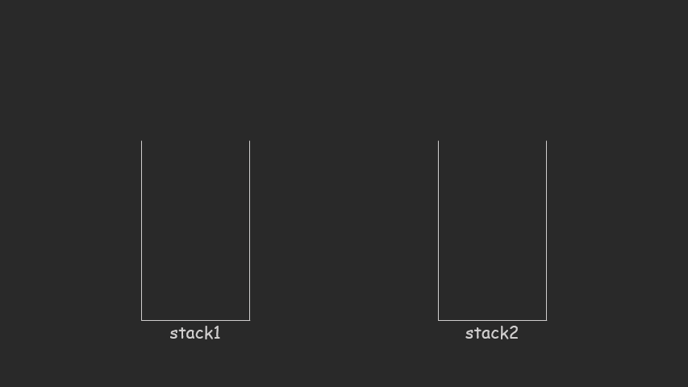

# [剑指 Offer 09. 用两个栈实现队列](https://leetcode-cn.com/problems/yong-liang-ge-zhan-shi-xian-dui-lie-lcof/)

用两个栈实现一个队列。队列的声明如下，请实现它的两个函数 `appendTail` 和 `deleteHead` ，分别完成在队列尾部插入整数和在队列头部删除整数的功能。(若队列中没有元素，`deleteHead` 操作返回 -1 )

 

**示例 1：**

```
输入：
["CQueue","appendTail","deleteHead","deleteHead"]
[[],[3],[],[]]
输出：[null,null,3,-1]
```

**示例 2：**

```
输入：
["CQueue","deleteHead","appendTail","appendTail","deleteHead","deleteHead"]
[[],[],[5],[2],[],[]]
输出：[null,-1,null,null,5,2]
```

**提示：**

- `1 <= values <= 10000`
- `最多会对 appendTail、deleteHead 进行 10000 次调用`

```c++
class CQueue {
    std::stack<int> s1,s2;
public:
    CQueue() {

    }

    void appendTail(int value) {
        s1.push(value);
    }
    int deleteHead() {
        int rst=-1;
        while (!s1.empty()){
            s2.push(s1.top());
            s1.pop();
        }
        if (!s2.empty()){
            rst = s2.top();
            s2.pop();
            while (!s2.empty()){
                s1.push(s2.top());
                s2.pop();
            }
        }
        return rst;
    }
};

/**
 * Your CQueue object will be instantiated and called as such:
 * CQueue* obj = new CQueue();
 * obj->appendTail(value);
 * int param_2 = obj->deleteHead();
 */
```

> 执行用时：1228 ms, 在所有 C++ 提交中击败了11.65% 的用户
>
> 内存消耗：111.3 MB, 在所有 C++ 提交中击败了100.00% 的用户

题解这种解法更好，少了复制过去的步骤



```c++
class CQueue {
    stack<int> stack1,stack2;
public:
    CQueue() {
        while (!stack1.empty()) {
            stack1.pop();
        }
        while (!stack2.empty()) {
            stack2.pop();
        }
    }
    
    void appendTail(int value) {
        stack1.push(value);
    }
    
    int deleteHead() {
        // 如果第二个栈为空
        if (stack2.empty()) {
            while (!stack1.empty()) {
                stack2.push(stack1.top());
                stack1.pop();
            }
        } 
        if (stack2.empty()) {
            return -1;
        } else {
            int deleteItem = stack2.top();
            stack2.pop();
            return deleteItem;
        }
    }
};
```
