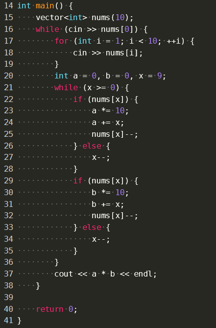

帮王艺颖做拼多多笔试


我的代码：没有测试，应该没啥问题

```c++
/*
 * @Author: your name
 * @Date: 2021-04-18 10:05:53
 * @LastEditTime: 2021-07-25 19:30:53
 * @LastEditors: your name
 * @Description: In User Settings Edit
 * @FilePath: \cmake_demo\contest.cpp
 */
#include "iostream"
#include "unordered_map"
#include "vector"
#include <algorithm>
using namespace std;
int main() {
    //先按起点排序,向后遍历时记录最远的终点,有比最远终点近得就返回ture
    int N;
    while (cin >> N) {
        vector<vector<int>> lines;
        for (int i = 0; i < N; ++i) {
            cin >> lines[i][0] >> lines[i][1];
        }
        sort(lines.begin(), lines.end());
        int farest_end = lines[0][1];
        bool found = false;
        for (int i = 1; i < N; ++i) {
            if (lines[i][1] <= farest_end) {
                cout << "true" << endl;
                found = true;
                break;
            }
            farest_end = max(farest_end, lines[i][1]);
        }
        if (!found) {
            cout << "false" << endl;
        }
    }

    return 0;
}

```

# 第二题


我的

```c++
/*
 * @Author: your name
 * @Date: 2021-04-18 10:05:53
 * @LastEditTime: 2021-07-25 19:30:53
 * @LastEditors: your name
 * @Description: In User Settings Edit
 * @FilePath: \cmake_demo\contest.cpp
 */
#include "iostream"
#include "unordered_map"
#include "vector"
#include <algorithm>

using namespace std;

int main() {
    int N;
    while (cin >> N) {
        vector<int> a(N), b(N);
        for (int i = 0; i < N; ++i) {
            cin >> a[i];
        }
        for (int i = 0; i < N; ++i) {
            cin >> b[i];
        }
        int rsta = 0, rstb = 0;
        unordered_map<int, int> mp; //存上一个出现i在cards中的位置
        vector<int> cards;
        for (int i = 0; i < N; ++i) {
            cards.push_back(a[i]);
            if (mp.find(a[i]) != mp.end() && mp[a[i]] != -1) {
                int st = mp[a[i]];
                for (int j = st; j < cards.size(); ++j) {
                    mp[cards[j]] = -1;
                    rsta++;
                }
                cards.erase(cards.begin() + st, cards.end());
            } else {
                mp[a[i]] = cards.size() - 1;
            }
            cards.push_back(b[i]);
            if (mp.find(b[i]) != mp.end() && mp[b[i]] != -1) {
                int st = mp[b[i]];
                for (int j = st; j < cards.size(); ++j) {
                    mp[cards[j]] = -1;
                    rstb++;
                }
                cards.erase(cards.begin() + st, cards.end());
            } else {
                mp[b[i]] = cards.size() - 1;
            }
        }
        for (int x : cards) {
            if (x % 2 != 0) {
                rsta++;
            } else {
                rstb++;
            }
        }
        cout << rsta << " " << rstb << endl;
    }
    return 0;
}

```

40%剩余应该是超时了

学习一下ac大佬

```c++
#include <bits/stdc++.h>
using namespace std;
int f(int p, vector<int> &cards)
{
    int i = 0, ret = 0;
    while (i != cards.size() && cards[i] != p)
        ++i;
    if (i != cards.size())
    {
        ret = cards.size() - i + 1;
        cards.resize(i);
    }
    else
        cards.push_back(p);
    return ret;
}
int main()
{
    int N, A = 0, B = 0, i = 0, j = 0;
    cin >> N;
    vector<int> a(N), b(N), cards;
    for (int i = 0; i < N; ++i)
        cin >> a[i];
    for (int i = 0; i < N; ++i)
        cin >> b[i];
    while (i < N || j < N)
    {
        while (i < N)
        {
            int t = f(a[i++], cards);
            A += t;
            if (t == 0)
                break;
        }
        while (j < N)
        {
            int t = f(b[j++], cards);
            B += t;
            if (t == 0)
                break;
        }
    }
    for (auto i : cards)
        i % 2 ? A++ : B++;
    cout << A << " " << B << "\n";
}
```

重点是这个resize太秀了

# 第三题


自己

```c++
#include "iostream"
#include "unordered_map"
#include "vector"
#include <algorithm>
using namespace std;
int main() {
    int T;
    cin >> T;
    while (T--) {
        int A, B, C, Q;
        cin >> A >> B >> C >> Q;
        while (Q > A) {
            if (Q % C == 0 && C != 1) {
                Q /= C;
            } else {
                Q -= B;
            }
        }
        cout << (Q == A) << endl;
    }
    return 0;
}
```

过60%，看了ac大佬的，应该从A到Q，我这么想很难覆盖所有场景，其实只要推一个表达式就知道咋回事了

大佬的

```c++
#include <bits/stdc++.h>
using namespace std;
using ll = long long;
int main()
{
    ll T, A, B, C, Q;
    cin >> T;
    while (T--)
    {
        cin >> A >> B >> C >> Q;
        if (C == 1)
        {
            if ((Q - A) % B == 0)
                cout << "1\n";
            else
                cout << "0\n";
        }
        else
        {
            ll flag = 0, t = A;
            while (t <= Q)
            {
                if (t % B == Q % B)
                {
                    flag = 1;
                    break;
                }
                t *= C;
            }
            if (flag)
                cout << "1\n";
            else
                cout << "0\n";
        }
    }
}
```

# 第四题




20%

大数问题，long不够大了